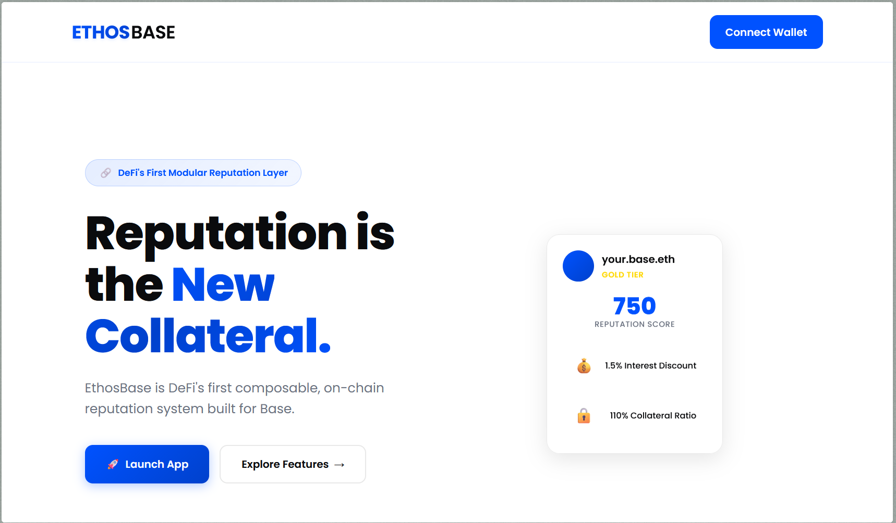

# EthosBase

EthosBase built on Base Chain. Users accumulate reputation scores based on their behavior, which unlocks better rates, lower collateral requirements, and access to exclusive pools.


<!-- Add video from YouTube-->
<iframe width="560" height="315" src="https://www.youtube.com/watch?v=mlEtiUaok_o" frameborder="0" allow="accelerometer; autoplay; clipboard-write; encrypted-media; gyroscope; picture-in-picture" allowfullscreen></iframe>
<!--  -->
## Features

### Core Reputation System
- **Multi-dimensional scoring**: Tracks loan repayments, staking behavior, flash loan usage, and community contributions
- **Weighted scoring algorithm**: Different categories have different impacts on total score
- **Time decay mechanism**: Scores naturally decay over time to encourage continued good behavior
- **Tier-based classification**: Bronze, Silver, Gold, and Platinum tiers

### Access Control Benefits
- **Dynamic loan terms**: Better reputation = lower collateral requirements and interest rates
- **Increased loan limits**: Higher tiers can borrow larger amounts
- **Exclusive pool access**: Premium users get access to special lending pools
- **Interest rate discounts**: Up to 2% discount for Platinum tier users

### React Frontend
- **Minimal Base design**: Clean UI with Base's color scheme and Poppins font
- **OnchainKit integration**: Official Base toolkit for wallet and identity
- **Real-time data**: Live blockchain data updates
- **Multi-wallet support**: Coinbase Wallet, MetaMask, WalletConnect
- **Basenames integration**: ENS-like names for Base addresses with management UI
- **Smart wallet ready**: Built-in support for smart contract wallets
- **Responsive**: Works on desktop and mobile

### Basename Integration
- **Address Resolution**: Automatically resolves .base.eth names to addresses
- **Profile Enhancement**: Display Basenames instead of hex addresses
- **On-chain Storage**: Link Basenames to reputation profiles in smart contracts
- **Management Interface**: Easy-to-use UI for setting and updating Basenames
- **Cross-protocol Benefits**: Basename-enhanced reputation works across all integrated DeFi protocols

### Reputation Categories

| Category | Weight | Actions Tracked |
|----------|--------|----------------|
| Loan Repayment | 40% | On-time repayments, defaults |
| Staking | 25% | Staking rewards, early unstaking |
| Community | 20% | Governance participation, contributions |
| Flash Loans | 15% | Proper usage vs abuse |


<!-- ## 🏗️ Architecture

```
ReputationSystem.sol          # Core reputation tracking and scoring
├── ReputationGatedAccess.sol # Access control and tier management  
├── ReputationLendingPool.sol # Example lending pool integration
└── MockERC20.sol            # Test tokens for development
```

## 🚀 Quick Start

### Prerequisites
- Node.js 16+
- Hardhat
- MetaMask
- Base Chain RPC access

### Installation

```bash
npm install
```

### Configuration

1. Copy environment variables:
```bash
cp .env.example .env
```

2. Add your private key and API keys to `.env`

### Deployment

Deploy to Base Sepolia (testnet):
```bash
npm run deploy:sepolia
```

Deploy to Base Mainnet:
```bash
npm run deploy
```

### Frontend Setup

```bash
cd frontend
npm install
npm run dev
```

Open http://localhost:3000 and connect your MetaMask wallet.

### Testing

Run the test suite:
```bash
npm test
```

Verify deployment:
```bash
npm run verify-deployment
```

## 📊 Reputation Tiers & Benefits

### Bronze (200-399 points)
- Max loan: 10,000 tokens
- Collateral ratio: 150%
- Interest discount: 0%
- Exclusive pools: ❌

### Silver (400-599 points)  
- Max loan: 50,000 tokens
- Collateral ratio: 130%
- Interest discount: 0.5%
- Exclusive pools: ❌

### Gold (600-799 points)
- Max loan: 200,000 tokens
- Collateral ratio: 110%
- Interest discount: 1%
- Exclusive pools: ✅

### Platinum (800+ points)
- Max loan: 1,000,000 tokens
- Collateral ratio: 105%
- Interest discount: 2%
- Exclusive pools: ✅ -->

<!-- ## 🔧 Integration Guide

### For DeFi Protocols

1. **Deploy the reputation system**:
```solidity
ReputationSystem reputation = new ReputationSystem();
ReputationGatedAccess access = new ReputationGatedAccess(address(reputation));
```

2. **Authorize your protocol as a scorer**:
```solidity
reputation.authorizeScorer(address(yourProtocol));
```

3. **Update reputation based on user actions**:
```solidity
reputation.updateReputation(
    user,
    ReputationSystem.ActionType.LOAN_REPAYMENT,
    50, // positive score change
    "On-time loan repayment"
);
```

4. **Check user access levels**:
```solidity
(string memory tier, uint256 maxLoan, uint256 collateralRatio, , ) = 
    access.getUserAccessLevel(user);
```

### Reputation Actions & Score Changes

| Action | Score Change | Description |
|--------|-------------|-------------|
| On-time loan repayment | +50 | Repaid before due date |
| Late loan repayment | +20 | Repaid after due date |
| Loan default | -100 | Failed to repay loan |
| Staking reward | +30 | Earned staking rewards |
| Early unstaking | -20 | Unstaked before maturity |
| Flash loan abuse | -50 | Detected malicious usage |
| Community contribution | +40 | Governance participation |

## 🛡️ Security Features

- **Access control**: Only authorized contracts can update reputation scores
- **Reentrancy protection**: All state-changing functions are protected
- **Score limits**: Scores are bounded between 0 and 1000
- **Time decay**: Prevents score inflation over time
- **Audit trail**: All reputation changes are logged with descriptions

## 🔮 Future Enhancements

- **Cross-protocol reputation**: Share reputation across multiple DeFi protocols
- **Machine learning scoring**: Advanced algorithms for fraud detection
- **Social features**: Reputation based on social connections and endorsements
- **Insurance integration**: Lower insurance premiums for high-reputation users
- **Governance tokens**: Reputation-weighted voting power -->


---

Built with ❤️ for the Base Chain ecosystem


<!-- 

📊 Analytics Dashboard - Visual reputation tracking
🏆 Achievement System - Gamification with badges/NFTs
💰 Advanced Lending - More loan options and features
👥 Social Features - Community endorsements and vouching
🔗 Protocol Integration - Connect with other DeFi platforms

 -->